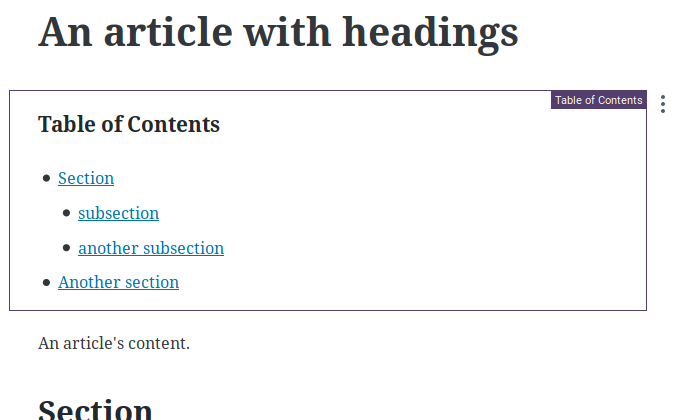
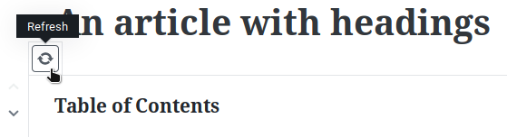
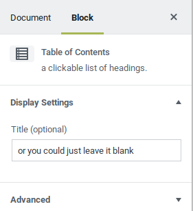

a Wordpress block with links to post headings.

## Installation

Simply [download](https://github.com/memuller/block-tableofcontents/archive/v0.1.0.zip), install and enable the plugin, and the block will be available within the Gutenberg editor.

You must be using the _Gutenberg_ editor, either by installing it as a plugin or by updating to Wordpress 5. __This plugin will do nothing in the Classic Editor.__ 

## Usage

When the block is added to a post, it will _automatically_ create a table of contents using the __headings__ currently present within the post.

If you change the headings, click the `Refresh` button to __update__ the table of contents.

You can also set a __title__ for the block on its property inspector. 

## Customization

The table of contents uses standard HTML elements (`<ul>s` and `<li>s`), so it will behave like a regular part of your post.

If you do need to change how it's displayed, note that the block is wrapped in a div with the `wp-block-memuller-table-of-contents` class; this class can then be used for custom CSS stylings within your theme.

## Roadmap

- use the core/List block so the tables are completly editable
- use properly nested lists
- support both ordered and unordered lists
- handle empty lists and invalid outline structures
- eject from create-guten-block, simplify scripts
